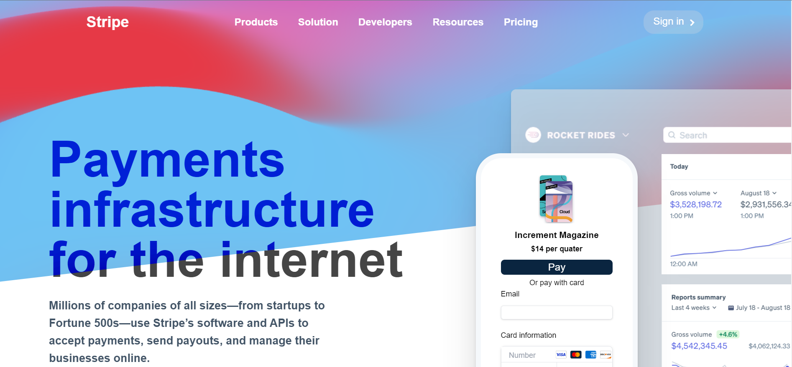

# the-gym-stripe-clone

## Welcome! 👋

This is a solution to the Gym Traning. The Gym challenge help us to improve our coding skills by building realistic projects.
In this exercise, we will use tailwindcss only. Try to use as much tailwindcss as you can. No vanilla CSS or BEM should be used. No custom CSS classes should be added to a CSS file. all CSS customization(if used) should be added to the tailwindcss config .

## Content

- [The-gym-stripe-clone](#The-gym-stripe-clone)
  - [Welcome! 👋](#welcome)
  - [The challenge](#the-challenge)
  - [Screenshot](#screenshot)
  - [Links](#links)
  - [My process](#my-process)
  - [Author](#author)
  - [Connect Us:](#connect-us)

### The challenge

The-gym-stripe-clone
Users should be able to:

- Try to implement the design below, using only HTML and tailwind,
- When you start the project, immediately create a "development" branch where you will do all your coding,
- When you are finished, create one large pull request (dev > main), which will then be reviewed by the code reviewer of your gym,
- This page was chosen based on the skewed lines and shapes across the page. pay attention to them and play with css rotate and transform properties to achieve a similar result.
- Stripe-page link: [Stripe-link](https://stripe.com/)

### Screenshot

### Links

- Live Site URL: [The-gym-stripe-clone]()

## My process

- HTML
- Tailwind
- Mobile-first workflow

## Author

- Twitter - [@ibrahim_Bagalwa](https://twitter.com/ibrahim_Bagalwa)
- LinkedIn - [ibrahim-bagalwa](https://www.linkedin.com/in/IbrahimBagalwa)

## Connect Us:

   

---

